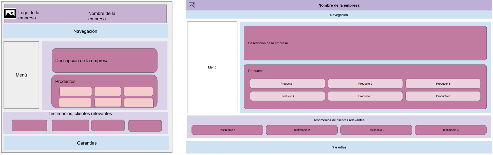

# Introducción a Sass

Práctica consistente en crear un mockup de landing page dado, aplicando los principios de Sass para conseguir un código más limpio, escalable y fácil de depurar.

Requerimientos: modularización del código mediante parciales (`_variables.scss`, `_mixins.scss`, `_base.scss`, etc.), definición de variables reutilizables y mixins, y aplicación de herencia.

<div align="center">
  
  <div style="font-style:italic; font-size:0.9em; margin-top:0;">
    Comparativa plantilla vs index.html. Izquierda: plantilla, Derecha: index.html (16:9).
  </div>
</div>

## Estructura del proyecto
```bash
IntroSass/
├── index.html            → Página principal del sitio
├── scss/
│   ├── _main.scss        → Declaración de estilos del elemento main y sus subelementos.
│   ├── _variables.scss   → Declaración de variables (colores, tipografías y padding)
│   ├── _base.scss        → Estilos globales aplicables a todo el sitio (body, header, nav y footer)
│   ├── _mixins.scss      → Mixins reutilizables (centrado de contenido, estilos del encabezado h2 y bloques)
│   └── style.scss        → Archivo principal que importa todos los parciales
├── images/               → Recursos gráficos del sitio (logo)
└── css/
    ├── style.css         → CSS compilado a partir de Sass
    └── style.css.map
```